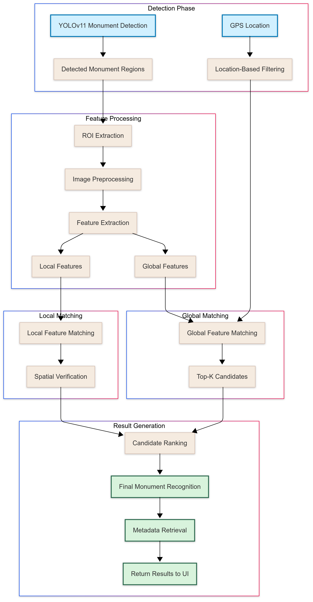
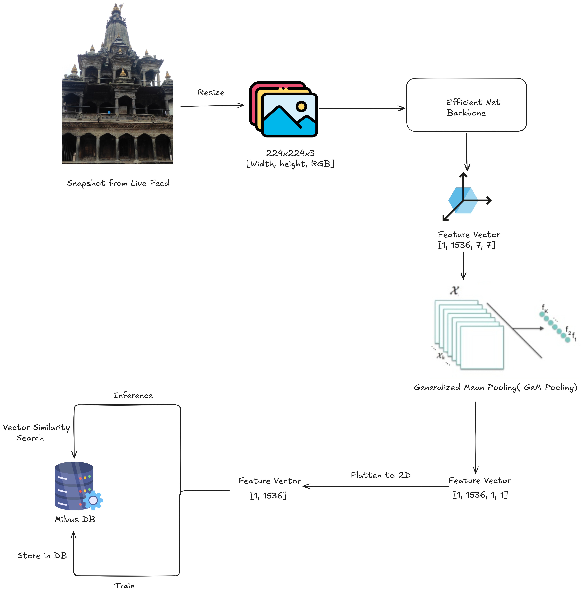

# Monument Recognition Pipeline for Travel Companion App

## Introduction
This repo is the core logic of Monument Recognition in real-time. It initially extracts **feature vectors** of multiple monuments and store those in a **vector database** for efficient similarity search. During inference, at first **YOLO** filters out probable regions of monuments in the frame, then it retrieves **top-k similar images** from the database as per the query image then **reranks the top-k results** based on  local features for robustness.

### Whole Recognition Pipeline


## Internal Architecture

### Global Feature Matching


For global feature vector extraction, we are using ***Hugging-Face timm models*** with option of ***Efficient Net*** or ***MobileNetV3*** as the backbone. And, feature vector is passed ***Generalized Mean Pooling*** layer. Finally, ***Milvus DB*** is used to store feature vectors and perform similarity search.

## Setup

1. Install anaconda/miniconda for environment management
2. Create Conda env from yaml file
    ```
    # conda env create -f <yaml-file>
    conda env create -f env.yml
    ```
3. Activate the environment
    ```
    # conda activate <env-name>
    conda activate cv-travel
    ```
4. Run the backend server
    ```
    python main.py
    ```

## Info Nuggets
1. ***main.py***  
    The FastAPI backend server code with pipeline
2. ***img.py***  
    Python script to test pipeline for an image
3. ***video.py***  
    Python script to test pipeline for a video
4. ***index_imgs.py***  
    Python script to index images in the vector database as well as search images by landmark name
5. ***libs/***  
    Contains external modules and libraries like ***LightGlue***
6. ***src/***  
    Contains source files
7. ***utils/***  
    Contains utility functions and classes
